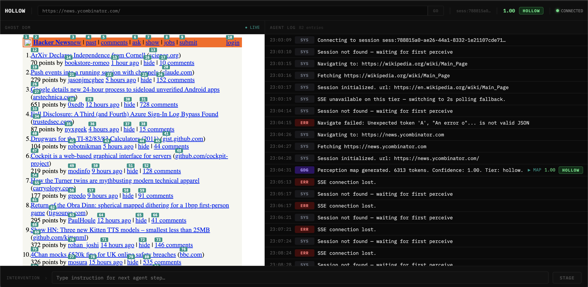

# Hollow

**A browser that has never run on a machine.**

[](LICENSE)
[](https://vercel.com)
[](https://hollow-tan-omega.vercel.app)

---

Hollow is a serverless DOM interpreter. It has the functional output of a browser — parsed DOM, executed JavaScript, calculated layout, navigable state — but exists purely as a web service. No Chromium. No GPU. No persistent process. No BaaS vendor.

It runs on Vercel. It is accessible via a URL. An AI agent can operate it with the laptop closed.



The agent reads the [GDG Spatial](https://github.com/Badgerion/GDG-browser) map. It decides what to do. It acts.

---

## Why

Every AI agent that needs to perceive the web chooses between two bad options:

**Headless Chrome** — real rendering, real coordinates. But 300MB binary, persistent VM process, $0.02–0.05/minute at BaaS providers, cold starts of 2–4 seconds, bot detection at the TLS handshake level.

**DOM simulators (JSDOM, Happy DOM)** — cheap and fast. But no layout engine, `getBoundingClientRect()` returns zero, no spatial map possible, silent JS failures.

Neither was designed for AI agents. Both were designed for humans.

Hollow is the third option: a browser engine purpose-built for machines. It calculates exact layout coordinates without painting a single pixel.

---

## How it works

A browser has two separable concerns: **layout** (where things are) and **painting** (how they look). Painting requires a GPU. Layout is pure mathematics — box model, flexbox rules, grid rules, cascade resolution.

Hollow strips the paint layer entirely and keeps the layout engine.

```
What a browser does for humans:     What Hollow keeps:
────────────────────────────────    ──────────────────
Fetch HTML/CSS/JS          ✓        Fetch HTML/CSS/JS
Parse DOM                  ✓        Parse DOM
Execute JavaScript         ✓        Execute JavaScript
Calculate layout           ✓        Calculate layout
Paint pixels to GPU        ✗        — dropped —
Composite layers           ✗        — dropped —
Display to screen          ✗        — dropped —
```

The pipeline:

1. **Network layer** — fetches the URL mimicking Chrome's TLS cipher suites (JA3/JA4)
2. **Happy DOM** — parses HTML, executes JavaScript, intercepts errors
3. **CSS resolver** — extracts computed styles: flexbox, grid, block/inline, position, box model
4. **Yoga layout engine** — calculates exact X/Y/W/H for every element. No screen. No GPU.
5. [**GDG Spatial**](https://github.com/Badgerion/GDG-browser) — converts coordinates to a structured spatial tree the AI reads
6. **Redis** — serializes session state (Brotli compressed) between steps

---

## [GDG Spatial](https://github.com/Badgerion/GDG-browser)

[GDG Spatial](https://github.com/Badgerion/GDG-browser) is Hollow's perception format. It gives AI agents a token-efficient, action-indexed map of the page — structured for how models reason, not how humans see.

```
[Viewport: 1280x800]

[nav: flex-row y:0 h:44]
  [1] a "Home"          x:0    w:80   h:44
  [2] a "About"         x:80   w:80   h:44
  [3] a "Login"         x:160  w:80   h:44

[main: flex-col y:44]
  [4] input:email       x:40   y:84   w:400  h:44
  [5] input:password    x:40   y:140  w:400  h:44
  [6] button "Submit"   x:40   y:196  w:400  h:48

[footer: grid 3-col y:276 h:60]
  [7] a "Privacy"       col:1
  [8] a "Terms"         col:2
  [9] a "Contact"       col:3
```

57–400 tokens per page. A screenshot costs 800–1500. [GDG Spatial](https://github.com/Badgerion/GDG-browser) is 10–20x cheaper and carries semantic information a vision model has to infer.

---

## The Hollow Router

Not all sites need the same approach. Hollow makes a tactical routing decision before touching the network:

| Route | Method | Coverage | Cost |
|-------|--------|----------|------|
| Mobile API Bypass | Format as iOS/Android client | Twitter/X, Reddit, Spotify | $0.00001/req |
| Cache Bypass | Bing Cache / Wayback Machine | Read-only research tasks | $0.00001/req |
| Hollow Standard | Happy DOM + Yoga | ~60% of the web | $0.00001/req |
| VDOM Hijack | Extract React/Vue Fiber tree | Gmail, Notion, Linear | $0.00005/req |
| WebSocket Telepathy | Raw WebSocket connection | Figma, Google Docs | $0.0001/req |
| API Telepathy | XHR interception + schema extraction | Canvas apps | $0.001/req |
| PWA Relay | User's phone as checkpoint | High-security WAFs | User attention |

**Zero Chromium. Zero BaaS. Zero vendor dependency.**

The 7% that hits PWA Relay is mostly high-stakes tasks (financial transactions, irreversible actions) that warrant human sign-off anyway.

---

## Matrix Mirror

Matrix Mirror is the observability UI — the human cockpit for Hollow sessions.

`hollow-tan-omega.vercel.app/mirror`

- **Start screen** — type a URL, hit GO. No curl. No session IDs.
- **Ghost DOM viewer** — the HTML Hollow has in memory, rendered live. You see exactly what the agent sees, including what it can't see.
- **Agent log** — timestamped stream of every perception, action, and decision.
- **Intervention bar** — type an instruction, inject it into the agent's next step.

---

## Quickstart

### Deploy your own

```bash
git clone https://github.com/Badgerion/hollow
cd hollow
npm install
```

Set environment variables:

```env
UPSTASH_REDIS_REST_URL=your_upstash_url
UPSTASH_REDIS_REST_TOKEN=your_upstash_token
```

```bash
vercel deploy
```

### Use the API

**Start a session:**

```bash
curl -X POST https://your-deployment.vercel.app/api/perceive \
  -H "Content-Type: application/json" \
  -d '{"url": "https://news.ycombinator.com"}'
```

**Act on an element:**

```bash
curl -X POST https://your-deployment.vercel.app/api/act \
  -H "Content-Type: application/json" \
  -d '{
    "sessionId": "sess:abc123",
    "action": { "type": "click", "elementId": 3 }
  }'
```

**Watch in the Mirror:**

```
https://your-deployment.vercel.app/mirror?session=sess:abc123
```

### Connect an AI agent

```typescript
import Anthropic from "@anthropic-ai/sdk";

const client = new Anthropic();
const HOLLOW = "https://hollow-tan-omega.vercel.app";

async function runAgent(task: string) {
  // Start Hollow session — agent decides where to go
  let { sessionId, gdgMap } = await fetch(`${HOLLOW}/api/perceive`, {
    method: "POST",
    headers: { "Content-Type": "application/json" },
    body: JSON.stringify({ url: "about:blank" }),
  }).then((r) => r.json());

  for (let step = 0; step < 10; step++) {
    const response = await client.messages.create({
      model: "claude-sonnet-4-20250514",
      max_tokens: 1024,
      system: `You are an AI agent operating a browser through Hollow.
You receive a [GDG Spatial](https://github.com/Badgerion/GDG-browser) map of the current page.
Actionable elements have IDs like [1], [2], [3].

Respond with JSON only:
{ "action": "navigate", "url": "https://..." }
{ "action": "click", "elementId": 3 }
{ "action": "fill", "elementId": 4, "value": "text" }
{ "action": "done", "result": "your answer" }`,
      messages: [
        { role: "user", content: `Task: ${task}\n\nPage:\n${gdgMap}` },
      ],
    });

    const decision = JSON.parse(response.content[0].text);
    if (decision.action === "done") return decision.result;

    const next = await fetch(`${HOLLOW}/api/act`, {
      method: "POST",
      headers: { "Content-Type": "application/json" },
      body: JSON.stringify({ sessionId, action: decision }),
    }).then((r) => r.json());

    gdgMap = next.gdgMap;
  }
}

runAgent("What are the top 3 stories on Hacker News right now?").then(
  console.log
);
```

---

## API reference

### POST /api/perceive

Fetch a URL and start a session.

| Field | Type | Description |
|-------|------|-------------|
| `url` | string | URL to fetch |
| `html` | string | Raw HTML (bypasses network fetch) |
| `sessionId` | string | Resume existing session |
| `stateId` | string | Hydra state provider hook (optional) |

Returns `{ sessionId, gdgMap, domDelta, confidence, jsErrors[], tier }`.

### POST /api/act

Apply an action to an existing session.

| Action type | Fields |
|-------------|--------|
| `click` | `elementId` |
| `fill` | `elementId`, `value` |
| `navigate` | `url` |
| `scroll` | `elementId`, `direction` |
| `select` | `elementId`, `value` |
| `hover` | `elementId` |

### GET /api/stream/:sessionId

SSE stream. Events: `dom_delta`, `log_entry`, `gdg_map`, `confidence`, `tier`.

### GET /api/session/:sessionId

Current session state. Used by Matrix Mirror polling fallback.

### DELETE /session/:sessionId

Clear session from Redis.

---

## Confidence scoring

Hollow scores each perception step from 0.0 to 1.0. Steps below 0.8 escalate to the next Router route.

```
base: 1.0
-0.05  per absolute/fixed positioned element
-0.10  per JS error (Vitality Monitor)
-0.05  per transform-positioned element
-0.03  per unresolved CSS variable affecting layout
-0.05  per JS-driven resize detected
```

The JS Vitality Monitor surfaces every Happy DOM failure in the Matrix Mirror log — turning silent failures into observable signals.

---

## Architecture decisions

**Why not Chromium on Lambda?**
Running a Chromium binary — even compressed — makes Hollow just another company running a bloated browser in the cloud. The Hollow Router eliminates the need. The hard 7% routes to PWA Relay on the user's phone.

**Why not BaaS (Browserbase, Steel)?**
Vendor dependency, surrendered margins, architectural impurity. The Router owns the full stack at a fraction of the cost.

**Why yoga-layout-prebuilt and not yoga-layout (WASM)?**
The WASM build hangs indefinitely on Vercel serverless cold starts. The prebuilt synchronous JS build is correct for this environment.

**Why Upstash Redis and not Vercel KV?**
Upstash supports pub/sub for SSE event streaming across separate serverless function instances. Vercel KV is deprecated in favour of Upstash anyway.

---

## Roadmap

**Phase 2 — The Router**
- [ ] VDOM Hijack (React/Vue Fiber tree extraction)
- [ ] WebSocket Telepathy + Skills registry
- [ ] API Telepathy (Canvas app detection)
- [ ] Mobile API Bypass
- [ ] Cache Bypass (Bing + Wayback Machine)
- [ ] PWA Relay (phone-based human checkpoint)
- [ ] Happy DOM polyfills (TextEncoder, IntersectionObserver...)
- [ ] Concurrent sessions (tabs)
- [x] Agent loop script (task-in, result-out, no URL required)
- [ ] Matrix Mirror v2 (macOS desktop, tab bar)
- [ ] Hydra inlet stub (StateProvider interface)

**Phase 3 — Standard**
- [ ] WASM → Cloudflare Workers
- [ ] ArtDOM open spec
- [ ] Framework native integrations (LangChain, AutoGen, CrewAI)

---

## License

Hollow is dual-licensed.

**Open source** — Apache License 2.0. Free to use, modify, and deploy for any purpose, including commercial use, subject to the terms of the Apache 2.0 license. See [LICENSE](LICENSE).

**Commercial license** — For teams that need a private fork, white-label rights, SLA-backed support, or a managed deployment on your own infrastructure, a commercial license is available from Artiqal Labs. Contact [hello@artiqal.com](mailto:hello@artiqal.com).

---

## Contributing

Issues and PRs welcome. See [CONTRIBUTING.md](CONTRIBUTING.md).

The most valuable contributions right now:
- Happy DOM polyfills (TextEncoder, IntersectionObserver, ResizeObserver)
- WebSocket schema Skills for popular apps
- [GDG Spatial](https://github.com/Badgerion/GDG-browser) ground-truth calibration data

---

*Built by Artiqal Labs. Hollow is the browser that was never built for you.*
